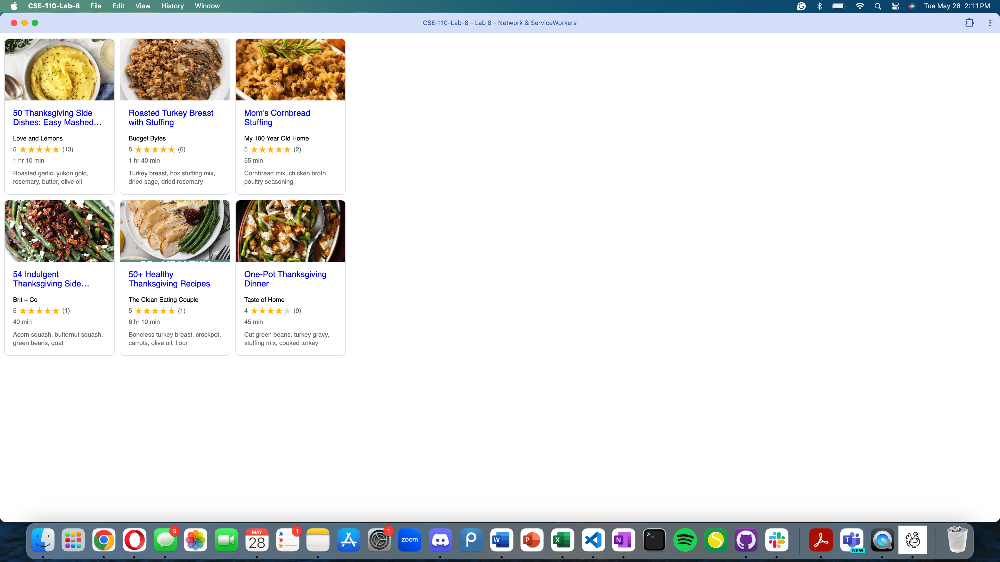

# Lab8-Starter

Name: Sanjith Devineni

GitHub Pages URL: https://sanjithdevineni.github.io/CSE-110-Lab-8/

Graceful degradation and service workers both aim to ensure a smooth user experience, even under poor conditions. Graceful degradation designs a web application to maintain basic functionality when advanced features aren't supported. Service workers enhance this by providing offline capabilities and caching resources. They intercept network requests to serve cached content, ensuring the app remains usable during network issues, thus supporting graceful degradation by keeping the app functional and fast under various conditions.

